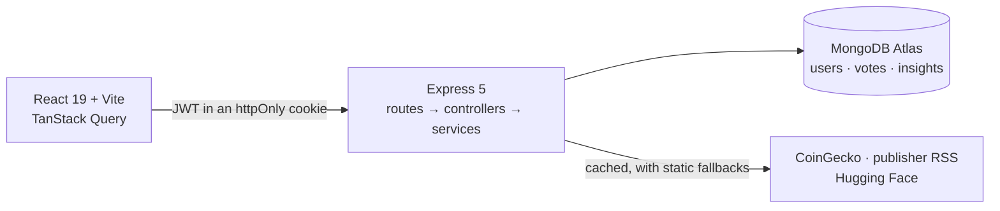

# AI Crypto Advisor

A daily crypto briefing assembled from how you actually invest.

**[ai-crypto-advisor-client-pi.vercel.app](https://ai-crypto-advisor-client-pi.vercel.app)** —
press **"Look around with a demo account"** on either auth screen and you land on a populated
dashboard, no signup. Give the first request up to a minute: the API runs on a free instance that
stops when nobody is using it.

## What it does

Three questions at sign-up — what kind of investor you are, which assets you follow, which
sections you want — and the dashboard is built from the answers. Nothing you didn't ask for
renders.

- **Coin prices** for your assets, in the order you picked them, refreshed every minute.
- **Market news** from four publishers, with headlines naming your assets lifted to the top.
- **An AI insight**, written once a day for the way you invest — from the day's events rather
  than from figures that expire by the afternoon.
- **A meme**, rotating daily.

All three answers are editable later from the profile link in the header, and the dashboard is
rebuilt from the new ones — including the insight, which is rewritten on the spot if you changed
how you invest.

Every section takes a thumbs up or down, and each vote is stored against the exact content it was
cast on, so the feedback is usable as a training signal rather than as a counter. Pressing a
pressed thumb withdraws it, so "no opinion" stays reachable after a mis-click.

Every card also states where its content came from. When a source is unreachable the section
falls back — to the last good response, or to fixed content — and the label changes with it, so a
fallback is never mistaken for today's data.

## Quick start

Requires Node 22 or newer.

```bash
npm install
npm run dev
```

The API comes up on `http://localhost:4000` and the client on `http://localhost:5173`.

**No configuration and no API keys are needed to run it.** With no `server/.env`, the API starts a
throwaway in-memory MongoDB and generates a session secret for that process, and says so in the
log — everything works, nothing survives a restart. Prices come from CoinGecko's public tier and
news from the publishers' RSS feeds, neither of which needs an account, and the memes are drawn
in this repository.

To keep your data, copy `server/.env.example` to `server/.env` and fill in a real `MONGODB_URI`
and `JWT_SECRET`.

### Configuration

| Variable              | Where  | Required      | Notes                                                      |
| --------------------- | ------ | ------------- | ---------------------------------------------------------- |
| `NODE_ENV`            | server | no            | `development`, `test`, or `production`                     |
| `PORT`                | server | no            | Defaults to 4000                                           |
| `CLIENT_ORIGIN`       | server | no            | Exact browser origin, for CORS. No trailing slash          |
| `MONGODB_URI`         | server | in production | Include the database name before the `?`                   |
| `JWT_SECRET`          | server | in production | At least 32 characters                                     |
| `VITE_API_BASE_URL`   | client | in production | Origin of the API. Defaults to `http://localhost:4000`     |
| `COINGECKO_API_KEY`   | server | never         | Free demo key. Raises a per-IP allowance, nothing more     |
| `HUGGINGFACE_API_KEY` | server | never         | Read token. Without it the insight is composed from prices |

The one key that changes what you see is `HUGGINGFACE_API_KEY`: with it the insight is **written
by a model** for the way you said you invest; without it the same card is **composed from the
day's real prices**. Both are true statements about live data, and the card says which one you're
reading.

Percent-encode special characters in the Mongo password — an unquoted `#` truncates the value
where the `.env` parser treats it as a comment.

### Other commands

```bash
npm run lint
npm run format
npm test
npm run build
npm run seed:demo --workspace server    # create the demo account
npm run check:db --workspace server     # confirm the database is reachable
```

`check:db` reports the host, database, collections and document counts, and never prints the
connection string.

## Architecture



The API is layered, and the layers aren't skipped. Routes map a path to a middleware chain and
one controller. Controllers read `request.userId`, call exactly one service, and send JSON — they
never touch Mongoose, validate input, or catch errors. Services hold the logic and are callable
from a script or a test because they never see `request` or `response`. Each external API gets a
thin client that only speaks HTTP; caching and fallbacks live in the service above it.

Two consequences worth knowing:

- **`errorHandler.js` is the only place an error becomes a response.** Everything else throws a
  typed error from `lib/httpErrors.js`. Unrecognised errors return a generic 500, because an
  unexpected message can leak paths or credentials.
- **`config/env.js` is the only module that reads `process.env`.** It validates at boot and exits
  with a readable list of what's wrong, rather than surfacing an `undefined` mid-request.

### Layout

```
client/src
  lib/            apiClient (the only fetch call), queryClient
  components/     ui (shadcn), layout (header, route guard)
  features/       auth · onboarding · dashboard — each owns its pages, hooks, and API module
server/src
  app.js          createApp() — builds the app without listening, so tests can drive it
  config/         env (Zod-validated), database
  routes/ controllers/ services/ models/ clients/
  middleware/     requireAuth, validateRequest, authRateLimiter, errorHandler, …
  data/           curated assets, quiz options, fallback content
```

## Deployment

The client is a static build on **Vercel**, the API is a web service on **Render**, and the
database is **MongoDB Atlas**. The two halves live on different origins, which is the whole reason
the configuration below is fussy.

| Where  | Setting                        | Value                                |
| ------ | ------------------------------ | ------------------------------------ |
| Render | Blueprint                      | [`render.yaml`](render.yaml)         |
| Render | `MONGODB_URI`, `CLIENT_ORIGIN` | entered in the dashboard             |
| Render | `JWT_SECRET`                   | generated by Render, never leaves it |
| Vercel | Root directory                 | `client`                             |
| Vercel | `VITE_API_BASE_URL`            | the Render URL, no trailing slash    |
| Atlas  | Network access                 | `0.0.0.0/0`                          |

Three things to know before changing any of it.

**`CLIENT_ORIGIN` is the CORS allow-list, and it has to match the browser's `Origin` header
exactly.** A trailing slash there means no signed-in request ever succeeds — so `config/env.js`
strips one rather than trusting anyone to remember. Set it once Vercel has assigned the frontend
its URL, then redeploy.

**`client/vercel.json` rewrites everything to `index.html`.** This is a single-page app: the
routes exist in the browser, not on disk. Without the rewrite, `/dashboard` works when you
navigate to it and 404s when you reload it — the kind of bug that only shows up in front of
somebody else.

**Atlas is open to `0.0.0.0/0`, and that's a real tradeoff.** Render's free tier has no static
outbound address, so no narrower rule would still let the API connect. What protects the database
is the credential, which makes the connection string the one secret here that must never be
committed or pasted anywhere. A paid tier would allow an IP allow-list instead, and should use one.

A free Render instance stops after fifteen minutes of inactivity and takes about a minute to come
back. The client fires a throwaway request at `/api/health` as it loads, so the wake starts while
you're reading the sign-in page rather than after you click something.

## Development

The rules this codebase is held to are written down rather than implied. [`CLAUDE.md`](CLAUDE.md)
is a router pointing at focused documents under [`.claude/docs/`](.claude/docs): git workflow,
naming and style, backend conventions, frontend conventions, testing policy. They're short on
purpose, so each can be read in full before the work it governs.

One branch and one pull request per unit of work; merges keep their history rather than squashing.
There are no git hooks — [CI](.github/workflows/ci.yml) runs `lint`, `format:check`, `test` and
`build` on every pull request, so run `npm run format` before pushing.

### Testing

Small on purpose, with the reasoning written into
[`.claude/docs/testing-policy.md`](.claude/docs/testing-policy.md) so it can't quietly grow. Two
integration tests carry the load — the auth flow, and voting including the revote path that proves
the unique index — plus a cache unit test and an end-to-end smoke test.

Tests run against a real MongoDB in memory rather than a mocked Mongoose, because the behaviour
worth covering — a unique compound index, for instance — lives in the database, and a mock
wouldn't have it.

## Roadmap

- A dark-mode toggle. The palette is already there in both themes; the switch isn't.
- An accessibility pass, and a Playwright smoke test over the signup → quiz → dashboard → vote
  path.
- Turning the collected votes into a training signal — the data model is designed for it and the
  votes are being stored; the write-up of how to use them isn't done.

## Documentation

- [`docs/decisions.md`](docs/decisions.md) — the stack, and every place the build ended up
  different from the plan it started with, including what was rejected.
- [`docs/ai-collaboration.md`](docs/ai-collaboration.md) — how this was built with AI tooling:
  what changed the result, what the tools caught, and where they were wrong.
- [`docs/assignment-brief.pdf`](docs/assignment-brief.pdf) — the original brief this was built
  against.
